# 🌐 Awesome Land Management

<p align="center">
  
</p>

<p align="center">
  <a href="https://github.com/ishandutta2007/Awesome-Awesome-Awesome"></a><a href="https://discord.gg/jc4xtF58Ve"></a>
  <a href="https://github.com/ishandutta2007/Awesome-Land-Management/stargazers"></a>
  <a href="https://github.com/ishandutta2007/Awesome-Land-Management/network/members"></a>
  <a href="https://github.com/ishandutta2007/Awesome-Land-Management/issues"></a>
  <a href="https://github.com/ishandutta2007/Awesome-Land-Management/blob/main/LICENSE"></a>
  <a href="https://github.com/ishandutta2007"></a>
</p>

---

## 📖 Overview & SEO Summary

Welcome to the definitive, community-curated ecosystem index for **Land Management Systems**, **GovTech Permitting Software**, **Municipal Planning & Zoning Platforms**, and **Cadastral GIS Stacks**.

Local governments, county administrations, civic technologists, and urban planning agencies rely on land management software to regulate building permits, inspect construction safety, enforce zoning codes, administer digital land records, and steer community development. This repository tracks premier commercial SaaS platforms alongside emerging open-source software, spatial data engines, and civic tools.

### 🎯 Primary Capabilities Covered
- 🏗️ **Permitting & Plan Review:** Digital permit application intake, automated review routing, fee calculation, and contractor licensing.
- 📐 **Zoning & Urban Planning:** 3D scenario visualization, parcel land-use regulations, development capacity modeling, and variance tracking.
- 🔍 **Field Inspections & Code Enforcement:** Mobile inspector workflows, citation management, safety compliance, and violation resolution.
- 🗺️ **Cadastral & Spatial Land Administration:** Parcel fabric maintenance, deed records, property tenure, and boundary mapping using GIS.

---

## 📑 Table of Contents
- [📊 Market Size & Industry Dynamics](#-market-size--industry-dynamics)
- [🏢 SaaS & Hosted Commercial Platforms](#-saas--hosted-commercial-platforms)
- [💻 Open-Source GitHub Projects](#-open-source-github-projects)
- [🧩 Architecture & Hybrid Deployment Best Practices](#-architecture--hybrid-deployment-best-practices)
- [🤝 How to Contribute](#-how-to-contribute)
- [📈 Star History](#-star-history)
- [💖 Support & Sponsoring](#-support--sponsoring)
- [⚖️ Disclaimer & License](#️-disclaimer--license)

---

## 📊 Market Size & Industry Dynamics

The global land management, municipal permitting, and licensing software sector represents an estimated **$2.1 Billion – $4.8 Billion** market (projected to expand at ~9.8% CAGR to **$11.2 Billion by 2034** as part of the broader **$800B+ GovTech** ecosystem); the sector is **moderately-to-highly fragmented** due to localized statutory building codes, decentralized county/city procurement, and distinct jurisdictional bylaws—though undergoing aggressive multi-suite consolidation by private equity sponsors and enterprise GovTech acquirers.

---

## 🏢 SaaS & Hosted Commercial Platforms

Below are the leading commercial land management and civic community development platforms, sorted in descending order of parent company size (valuation / annual revenue).

| Platform | Core Capabilities & Civic Focus | Company Size (Valuation / Revenue) | Starting Pricing Tier | Free Tier / Trial Limits | Deployment Model |
| :--- | :--- | :--- | :--- | :--- | :--- |
| **[CityView](https://www.cityview.com/)** | End-to-end municipal suite for planning, permitting, inspections, licensing, and citizen portal management. | **~$85B Valuation / $8.4B Rev** *(Constellation Software / Harris Computer - TSX: CSU)* | **~$15,000 / year** *(Entry municipal license for core permitting & planning)* | **No free-forever plan; 14-day guided sandbox demo** with sample municipal dataset upon sales qualification. | Cloud SaaS / Hybrid On-Prem |
| **[Tyler EnerGov](https://www.tylertech.com/)** | Enterprise civic development solution covering land-use planning, eReviews, licensing, and automated enforcement. | **~$24B Market Cap / $2.1B Rev** *(Tyler Technologies - NYSE: TYL)* | **~$30,000 / year** *(Base community tier; seat licenses typically ~$1,200–$2,500/seat/yr)* | **No free-forever plan; 30-day proof-of-concept staging sandbox** during formal municipal RFP evaluation. | Cloud SaaS *(AWS GovCloud)* |
| **[Cityworks](https://www.cityworks.com/)** | GIS-centric Permits, Licensing & Land (PLL) and enterprise asset management built natively on Esri ArcGIS technology. | **~$16B Market Cap / $3.8B Rev** *(Trimble Inc. - NASDAQ: TRMB)* | **~$27,000 / year** *(Standard starter package for 20 named users; ~$1,200/additional user/yr)* | **No free-forever plan; 30-day piloted proof-of-value sandbox** for qualified public agencies. | Cloud Hosted / On-Prem |
| **[Infor Public Sector](https://www.infor.com/)** | Large-scale civic ERP and Community Development & Regulation (CDR) suite for major cities, counties, and utilities. | **~$13B Valuation / $3.5B Rev** *(Infor / Koch Industries)* | **~$40,000 / year** *(Entry municipal tier for baseline CDR and permitting module)* | **No free-forever plan; 30-day guided virtual test-drive sandbox** during competitive RFP reviews. | Cloud SaaS *(AWS)* |
| **[ArcGIS Urban](https://www.esri.com/en-us/arcgis/products/arcgis-urban/overview)** | 3D web-based scenario planning and zoning analysis software to visualize land capacity, envelope rules, and zoning changes. | **~$10B+ Valuation / $1.8B Rev** *(Esri - Environmental Systems Research Institute)* | **~$8,250 / year** *(GIS Professional Plus / Urban add-on tier; public stakeholder viewers are free)* | **21-day full-featured trial** *(Includes ArcGIS Online organization, 200 service credits, 1 admin seat, 3D city models)*. | Cloud Web App *(Esri SaaS)* |
| **[CentralSquare](https://www.centralsquare.com/)** | Integrated public sector platform providing Community Development, TRAKiT, parcel tracking, and inspector routing. | **~$2.5B Valuation / $450M Rev** *(Backed by Bain Capital & Vista Equity Partners)* | **~$18,000 / year** *(Entry annual subscription for Community Development module in small jurisdictions)* | **No free-forever plan; 14-day guided proof-of-concept environment** provisioned upon qualification. | Cloud SaaS / Hybrid |
| **[OpenGov Land Management](https://opengov.com/)** | Modern cloud platform for building permits, business licenses, code enforcement, and citizen self-service portals. | **$1.8B Valuation / $110M Rev** *(Acquired by Cox Enterprises, 2024)* | **~$15,000 / year** *(Small-jurisdiction starter annual tier for core permitting & licensing)* | **No free-forever plan; 14-day structured interactive sandbox** after introductory discovery consultation. | Cloud-Native SaaS |
| **[Accela Land Management](https://www.accela.com/)** | Flagship Civic Platform automating complex zoning, commercial building reviews, environmental health, and licensing. | **~$500M+ Valuation / $120M Rev** *(Berkshire Partners & Francisco Partners)* | **~$25,000 / year** *(Civic Applications starter tier; seat licenses start around ~$1,500/seat/yr)* | **No free-forever plan; 30-day evaluation sandbox environment** available during competitive RFP tenders. | Cloud SaaS *(Microsoft Azure)* |
| **[Cloudpermit](https://cloudpermit.com/)** | Agile, cloud-native permitting, plan review, and mobile inspection solution built specifically for local and regional governments. | **~$80M Valuation / $15M Rev** *(Venture-backed growth stage)* | **~$6,000 / year** *(Entry tier for municipalities under 10k population; includes unlimited staff users)* | **No free-forever plan; 14-day full-featured sandbox demo** with guided onboarding demonstration. | Cloud-Native SaaS |
| **[Clariti](https://www.clariti.com/)** | Turnkey permitting, trade licensing, and inspections software built on the Salesforce Government Cloud architecture. | **~$60M Valuation / $12M Rev** *(Growth equity backed)* | **~$1,800 / user / year** *(Minimum starter commitment of ~$18,000/yr for 10-user department bundle)* | **No free-forever plan; 14-day personalized sandbox demo instance** following architectural discovery. | Cloud SaaS *(Salesforce)* |

---

## 💻 Open-Source GitHub Projects

Open-source land management tooling spans cadastral mapping, spatial databases, demographic simulation, citizen reporting, and pro-poor land recordation. Below are notable open-source repositories sorted in descending order of GitHub star count.

1. **[QGIS](https://github.com/qgis/QGIS)** [](https://github.com/qgis/QGIS/stargazers)  
   The de facto standard open-source desktop Geographic Information System. Extensively utilized by municipal GIS teams, urban planners, and cadastral authorities for digitizing parcels, designing zoning overlays, and publishing maps.

2. **[OSMnx](https://github.com/gboeing/osmnx)** [](https://github.com/gboeing/osmnx/stargazers)  
   Python package for downloading, modeling, analyzing, and visualizing street networks, parcel geometries, and urban spatial features directly from OpenStreetMap.

3. **[GeoPandas](https://github.com/geopandas/geopandas)** [](https://github.com/geopandas/geopandas/stargazers)  
   Open-source project making geospatial operations in Python intuitive. Forms the computational backbone for parcel overlay checking, zoning boundary intersections, and cadastral data wrangling.

4. **[OpenAddresses](https://github.com/openaddresses/openaddresses)** [](https://github.com/openaddresses/openaddresses/stargazers)  
   Global repository and processing infrastructure for open civic data, aggregating hundreds of millions of address points, building footprints, and parcel boundaries worldwide.

5. **[PostGIS](https://github.com/postgis/postgis)** [](https://github.com/postgis/postgis/stargazers)  
   The industry-standard spatial database extender for PostgreSQL. Stores parcel fabric polygons, municipal zoning districts, historical permit coordinates, and spatial indexes for high-speed spatial queries.

6. **[PySAL](https://github.com/pysal/pysal)** [](https://github.com/pysal/pysal/stargazers)  
   Python Spatial Analysis Library for regional science and urban planning. Supplies algorithms for spatial econometrics, urban land value surface modeling, and spatial cluster detection.

7. **[FixMyStreet](https://github.com/mysociety/fixmystreet)** [](https://github.com/mysociety/fixmystreet/stargazers)  
   Turnkey map-based civic issue reporting platform developed by mySociety. Connects citizen complaints directly to local authority casework systems, inspection workflows, and street maintenance teams.

8. **[HOT Tasking Manager](https://github.com/hotosm/tasking-manager)** [](https://github.com/hotosm/tasking-manager/stargazers)  
   Collaborative mapping and land parcel delineation coordination tool created by the Humanitarian OpenStreetMap Team (HOT) for orchestrating distributed field surveying.

9. **[UrbanSim](https://github.com/UDST/urbansim)** [](https://github.com/UDST/urbansim/stargazers)  
   Open modeling platform for simulating urban land use, real estate markets, transportation demand, and municipal zoning scenario impacts across regional horizons.

10. **[STDM – Social Tenure Domain Model](https://github.com/gltn/stdm)** [](https://github.com/gltn/stdm/stargazers)  
    Pro-poor land recordation tool developed by the Global Land Tool Network (GLTN) and UN-Habitat. Built on top of QGIS and PostgreSQL/PostGIS to record flexible tenure relationships in customary lands and informal settlements.

11. **[Planscape](https://github.com/OurPlanscape/Planscape)** [](https://github.com/OurPlanscape/Planscape/stargazers)  
    Open-source landscape-scale planning application developed in partnership with the State of California. Synthesizes spatial datasets and fire behavior models to prioritize regional land treatments and wildfire resilience.

12. **[Digital Land Python](https://github.com/digital-land/digital-land-python)** [](https://github.com/digital-land/digital-land-python/stargazers)  
    Open-source data transformation toolset developed by the UK Ministry of Housing, Communities & Local Government (MHCLG) to standardize brownfield land registers, local planning data, and conservation area boundaries.

---

## 🧩 Architecture & Hybrid Deployment Best Practices

Because full-scale municipal permitting requires complex legal plan review, automated statutory fee formulas, and financial settlement, most forward-looking jurisdictions implement a **hybrid architectural model**:

```text
┌─────────────────────────────────────────────────────────────┐
│                 Public Citizen & Builder Portal              │
│       (Permit Intake, Plan Submission, Fee Processing)      │
└──────────────────────────────┬──────────────────────────────┘
                               │
┌──────────────────────────────▼──────────────────────────────┐
│           Commercial Land Management / Permitting SaaS       │
│  (Accela, OpenGov, Tyler EnerGov, Cloudpermit, CentralSquare)│
└──────────────────────────────┬──────────────────────────────┘
                               │ Bi-directional Geospatial Sync
┌──────────────────────────────▼──────────────────────────────┐
│             Open Enterprise Spatial Data Warehouse           │
│           (PostgreSQL / PostGIS + GeoServer / QGIS)          │
├─────────────────────────────────────────────────────────────┤
│  • Cadastral Parcel Fabric   • Zoning & Land-Use Bylaws     │
│  • Flood & Environmental     • Utility & Easement Overlays   │
└──────────────────────────────┬──────────────────────────────┘
                               │
┌──────────────────────────────▼──────────────────────────────┐
│            Open Analytics, Urban Modeling & Transparency    │
│            (UrbanSim, GeoPandas, PySAL, Open Data Hub)      │
└─────────────────────────────────────────────────────────────┘
```

1. **Store parcel fabric and legal boundaries** in robust spatial databases like **PostGIS** with precision geometry validations.
2. **Execute statutory permit intake, fees, and code enforcement** inside commercial SaaS platforms to maintain regulatory compliance.
3. **Analyze development capacity and growth projections** utilizing open-source spatial analytical tooling like **UrbanSim** and **GeoPandas**.
4. **Publish open civic datasets** via standard GeoJSON and OpenAddresses formats to empower civic developers and citizens.

---

## 🤝 How to Contribute

Contributions are warmly encouraged! To propose additions or corrections:

1. 🍴 **Fork** this repository.
2. 🌿 **Create a new branch**: `git checkout -b feature/add-new-platform`.
3. 📝 **Edit `README.md`**: Follow existing formatting, provide transparent pricing/tier details, and include official documentation links.
4. 📬 **Submit a Pull Request** with a concise summary of the addition.

---

## 📈 Star History

[](https://star-history.dera.page/#ishandutta2007/Awesome-Land-Management&type=date&legend=top-left)

---

## 💖 Support & Sponsoring

Thank you for exploring and supporting **Awesome Land Management**! 🌟

If this curated reference helps your agency, research, or development workflows, please consider:
- ⭐ **Starring** the repository on GitHub.
- 🍴 **Forking** and contributing additional resources.
- 📢 **Sharing** this repository with fellow planners, GIS analysts, and civic developers.
- ☕ **Buying a coffee or sponsoring ongoing maintenance** via the **[GitHub Sponsor Dashboard](https://github.com/sponsors/ishandutta2007)**.

Your sponsorship helps keep this ecosystem directory accurate, up-to-date, and comprehensively documented.

---

## ⚖️ Disclaimer & License

- **Disclaimer:** This ecosystem index is compiled for research and civic informational purposes. It does not constitute legal, planning, or procurement advice. Municipalities must perform comprehensive security, compliance, and regulatory evaluations when procuring software.
- **License:** Distributed under the [MIT License](file:///C:/Users/ishan/Documents/Projects/Awesome-Land-Management/LICENSE). Built with pride for planners, building officials, and civic technologists worldwide.
